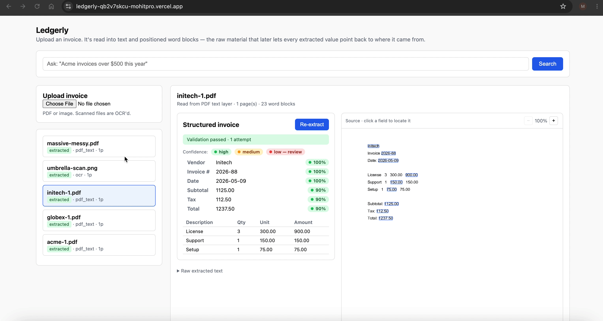

# Ledgerly

[CI](https://github.com/mohitmm806/ledgerly/actions/workflows/ci.yml)

Reads invoices and receipts into structured data, lets you query them in plain
English, and keeps every extracted value traceable back to where it came from on
the page so a person can actually trust it.

Live demo: [ledgerly-qb2v7skcu-mohitpro.vercel.app](http://ledgerly-qb2v7skcu-mohitpro.vercel.app)

> Note: the demo runs on a free tier that sleeps after inactivity, so the first
> request may take ~30–50 seconds to wake the server. Subsequent requests are
> fast.





**Companion docs:** [DECISIONS.md](DECISIONS.md) is the one to read alongside
this — it walks through every scoping and design decision, and a few I'd redo.
It's the *why* behind everything below. [DEPLOY.md](DEPLOY.md) covers shipping it.

## Why invoices

The prompt was "messy documents into structured, queryable data," which could
mean almost anything, so the first move was to pick a real person: a
small-business bookkeeper doing invoice entry by hand. It's a boring problem,
which is why it's a good one. The value is obvious and I can tell whether I've
solved it.

I read the prompt as two jobs. "Structured" is the extraction part, which is
mostly a solved problem now if you hand a model a schema. The parts that are
under-built in most tools are "queryable" and, more importantly, *trustworthy*.
A bookkeeper won't trust a pile of auto-extracted numbers unless they can
spot-check them fast. So that's where the depth went.

## What it does

Upload a PDF or image. It extracts the vendor, dates, totals, and line items
into a fixed schema, then does the things most extraction demos skip:

**It corrects itself.** Extraction isn't one model call. It extracts, checks
whether the numbers reconcile (line items sum to subtotal, subtotal + tax =
total, and so on), and if they don't it goes back to the model with the specific
discrepancy and tries again. Most first-pass errors get fixed on the second try.

**It shows where every number came from.** Click any extracted value and it
highlights the exact region on the source document it was read from. No scrolling
back and forth to verify.

**It only asks you to check what's uncertain.** Confidence per field comes from
whether the value reconciles and whether it grounded cleanly, not from the model
claiming it's sure. Low-confidence fields are flagged; everything else you can
trust at a glance.

**It's queryable in plain English.** "Acme invoices over $500 this year" gets
translated into a structured filter, which is shown back to you so the
interpretation is visible, then run against the database.

## The hard part: grounding

This is the piece I'd point at in a review. When the model says "Total: $1,240,"
Ledgerly maps that back to the pixels on the page it came from.

It's harder than it sounds because the model's value rarely matches the page
verbatim. "$1,240.00" on the page vs `1240.0` in the extraction; values split
across OCR tokens; the same number appearing twice. Grounding tries progressively
looser strategies and stops at the first hit: exact match, then normalized
(numbers compared numerically, text stripped to alphanumerics), then a span of
consecutive tokens whose concatenation matches, then an honest "couldn't place
it" rather than a guess. Word coordinates are captured at ingest, before the
model ever runs, because they can't be reconstructed afterward.

## How good is it

I didn't want "it works" to be an assertion, so there's a labeled eval set in
`backend/eval/` and a harness that measures against it.

Measured on the digital-PDF invoices with Groq's `llama-3.3-70b-versatile`:


| Metric                                                                 | Result       |
| ---------------------------------------------------------------------- | ------------ |
| Field-level accuracy (vendor / number / date / subtotal / tax / total) | 100% (24/24) |
| Line-item precision / recall                                           | 100% / 100%  |
| Grounding accuracy (correct fields located on the page)                | 100%         |
| First-pass clean / recovered by self-correction                        | 100% / 0%    |


I'd rather be honest than impressive: a perfect score on a small set should make
you suspicious, so here's exactly what it does and doesn't show. This run covers
four clean-to-semi-clean digital PDFs — a capable model handles those well, so it
validates the pipeline end to end but doesn't stress it, and the self-correction
loop never needed to fire (everything passed first try). The interesting inputs
are the ones not in this number:

- **The OCR'd receipt** isn't in this local run because it needs the `tesseract`
binary (the deployed container has it; my dev machine didn't). OCR is where
grounding gets hard — noisier coordinates, money formatting — and the fallback
is built to degrade to a looser box rather than a wrong one.
- **Real-world invoices.** Testing with an actual agency invoice surfaced a 30%
discount the schema didn't model, so the total didn't reconcile. The validation
caught it and flagged the fields before I added discount support — the
human-in-the-loop loop doing its job.

Reproduce:

```bash
cd backend
LLM_PROVIDER=groq GROQ_API_KEY=... python -m eval.run_eval
```

The scoring functions are pure and unit-tested (`tests/test_eval.py`); the
harness plumbing is tested against a fake model, so only the accuracy run itself
needs a live key.

## What I left out on purpose

- **Auth / multi-tenancy.** Single-user tool for this exercise; auth is plumbing.
- **Arbitrary document types.** Narrowing to invoices is what makes extraction
and honest evaluation possible.
- **Custom OCR training.** Off-the-shelf OCR is good enough to reach the
interesting problem: handling what it gets wrong.
- **Accounting-software sync.** Real feature, out of scope for five days.

The reasoning behind each of these cuts — and every other design decision — is
in [DECISIONS.md](DECISIONS.md).

## Running it

No Docker needed for local dev. It defaults to a SQLite file, so there's nothing
to stand up.

```bash
cd backend
pip install -r requirements.txt
python seed.py          # loads sample invoices so the UI isn't empty
uvicorn app.main:app --reload --port 8000
```

```bash
cd frontend
npm install
npm run dev
```

Open [http://localhost:5173](http://localhost:5173). Extraction and natural-language query call an LLM.
Pick a provider to enable them — the free option is **Groq**: set
`LLM_PROVIDER=groq` and `GROQ_API_KEY=...` (a free key from console.groq.com, no
credit card). Anthropic is also supported (`LLM_PROVIDER=anthropic`,
`LLM_API_KEY=...`). Without a provider, ingestion, grounding of seeded data,
browsing, and structured filtering still work; the two model-backed endpoints
return an honest 503. See `.env.example` for all options.

### With Postgres, via Docker

```bash
docker compose up --build
```

Brings up Postgres, the API, and the web UI together.

## Tests and eval (two different things)

```bash
make test        # backend (pytest): parsing, validation, self-correction recovery,
                 # grounding, confidence, query filters, routes. No network.
make front-test  # frontend (Vitest): grounding-box geometry, confidence bucketing,
                 # and a review-panel render test.
make eval        # accuracy against the labeled set (needs a provider key, e.g. Groq)
```

`make test` / `make front-test` catch regressions; `make eval` measures quality.
Keeping them separate means neither hides behind the other. The frontend tests
focus on the bits with real logic — the coordinate math that places grounding
boxes (if it breaks, every highlight lands wrong) and the confidence thresholds —
rather than chasing coverage on presentational markup.

## Layout

```
backend/
  app/
    ingestion.py         pdf + OCR text extraction, always with coordinates
    extraction/
      invoice_schema.py  the structured target (Pydantic)
      extractor.py       the self-correcting extraction loop
      validation.py      the hard arithmetic/schema checks
      grounding.py       value -> on-page location, with fallback hierarchy
      confidence.py      per-field confidence from grounding + validation
      llm.py             model behind a small interface (+ deterministic fake)
    query/               structured filter + natural-language translation
    rendering.py         page -> PNG for the review overlay
    routers/             documents, query
  eval/                  labeled set + accuracy harness
  tests/
frontend/
  src/components/        upload, list, review (fields + source overlay), query
docker-compose.yml
```

